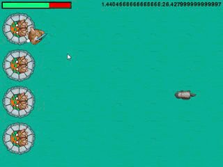
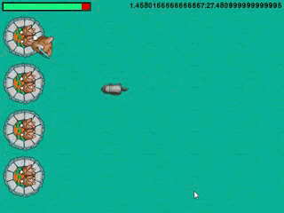

# Angry Bunnies
## Introduction
This project is a mini-game called 
*Angry Bunnies*, implemented in python.

## Requirements
 * python 3+
 * pygame, random, math

## Reference:
> https://www.raywenderlich.com/2795-beginning-game-programming-for-teens-with-python
## Effect:

